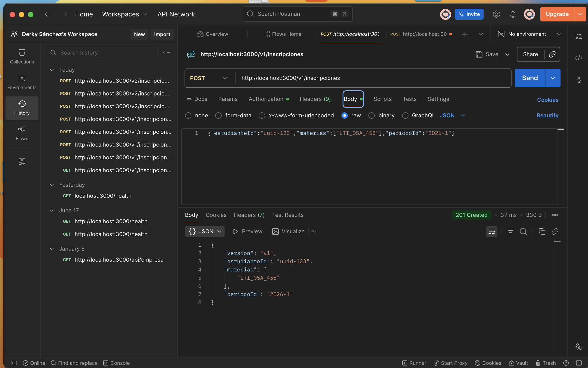
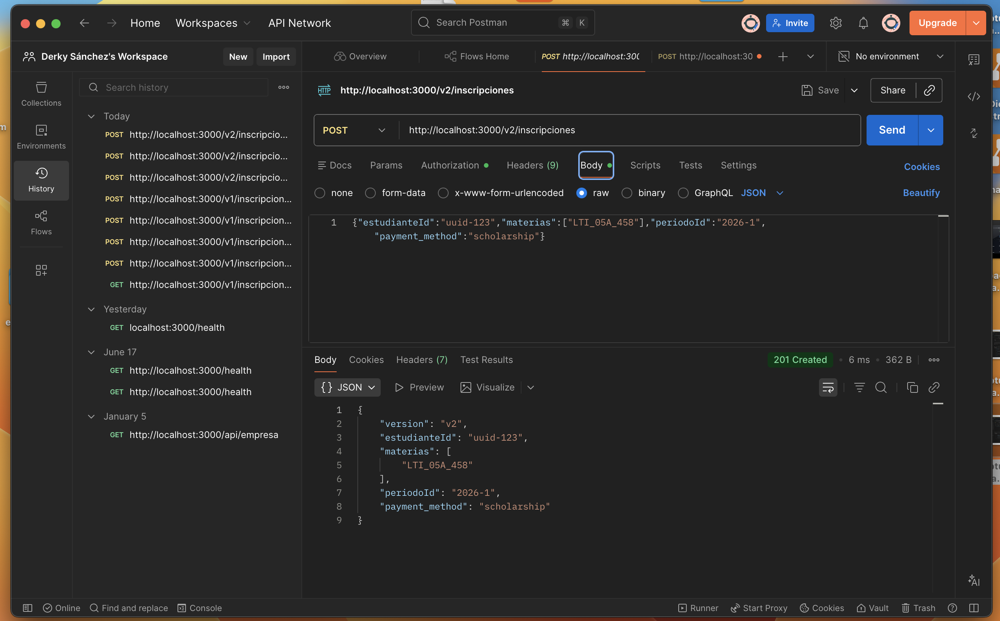
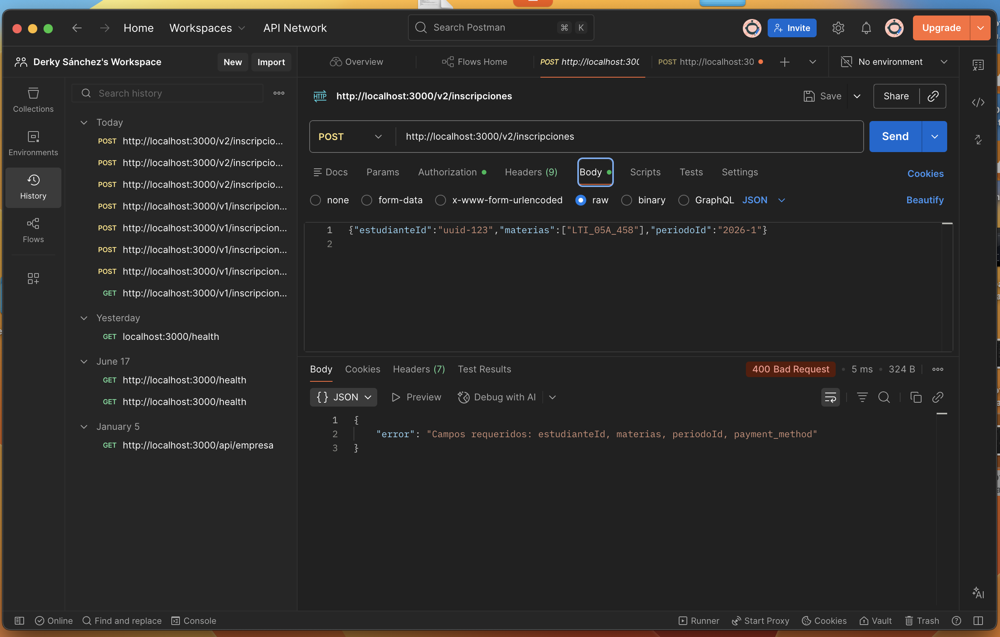
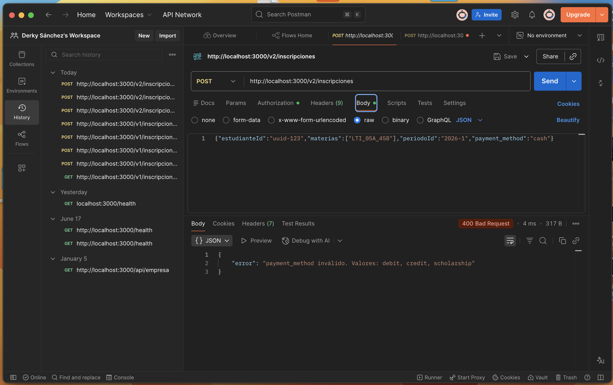
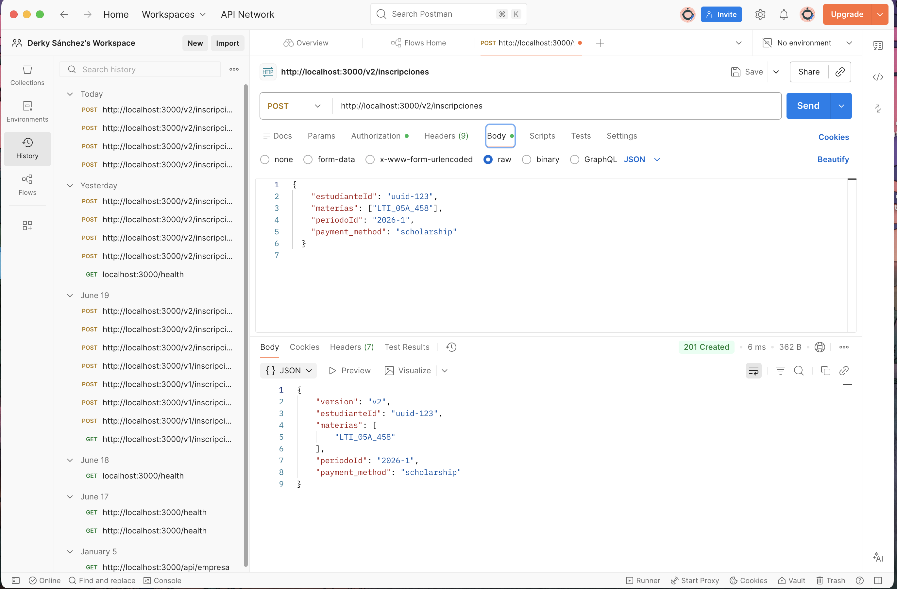
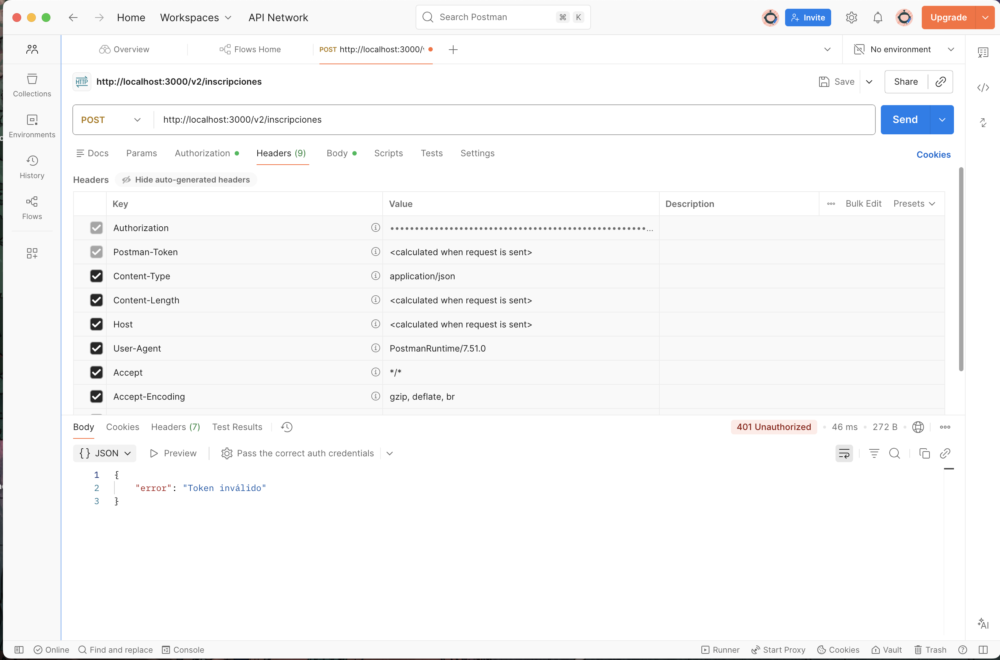
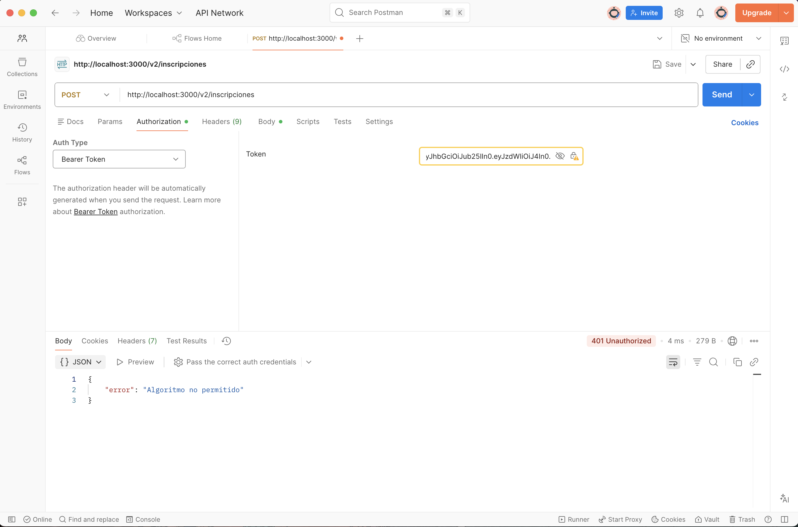

Sin API key -> esperado: 401
comando: curl http://localhost:3000/health
salida real de terminal: GET /health -> 401 (6ms)
observación: El middleware bloquea la petición antes de que llegue a la ruta porque el header x-api-key hace falta, devolviendo un JSON con el mensaje de error de autenticación.

Con clave válida -> esperado: 200
comando: curl -H "x-api-key: secreto-demo" http://localhost:3000/health
salida real de terminal: GET /health -> 200 (1ms)
observación: Al incluir la clave correcta en la cabecera, el middleware permite el acceso con éxito y el endpoint responde con un JSON que contiene el estado "ok" y la fecha/hora actual de la consulta.

Ruta inexistente -> esperado: 404
comando: curl -H "x-api-key: secreto-demo" http://localhost:3000/noexiste
salida real de termianl: GET /noexiste -> 404 (1ms)
observación: La petición pasa la seguridad de la API key correctamente, pero el enrutador de Express no encuentra la ruta /noexiste, respondiendo con la plantilla HTML por defecto para un error 404.

## Testing

npm test
user@Derky api_derky % npm test

> api_derky@1.0.0 test
> NODE_OPTIONS='--experimental-vm-modules' jest

(node:12536) ExperimentalWarning: VM Modules is an experimental feature and might change at any time
(Use `node --trace-warnings ...` to show where the warning was created)
 PASS  src/middlewares/auth.test.ts
  API Key Middleware
    ✓ debe devolver 401 si no existe x-api-key (5 ms)
    ✓ debe devolver 401 si la clave es incorrecta (1 ms)
    ✓ debe invocar next() si la clave es válida (1 ms)

 PASS  src/middlewares/logger.test.ts
  Logger Middleware
    ✓ debe invocar next() correctamente al recibir una petición (2 ms)
    ✓ debe registrar el método y la ruta correctamente (1 ms)

Test Suites: 2 passed, 2 total
Tests:       5 passed, 5 total
Snapshots:   0 total
Time:        0.773 s, estimated 1 s
Ran all test suites.

## Pruebas de los endpoints

Servidor corriendo en `http://localhost:3000`. Autenticacion: header `x-api-key: secreto-demo`.

### Escenario 1 — POST /v1/inscripciones con campos válidos (esperado: 201)



### Escenario 2 — POST /v2/inscripciones con payment_method válido (esperado: 201)



### Escenario 3 — POST /v2/inscripciones sin payment_method (esperado: 400)



### Escenario 4 — POST /v2/inscripciones con payment_method inválido (esperado: 400)



### Init sin errores 

## 🧠 Reflexión sobre el Contrato de la API

Si otro equipo comenzara a consumir esta API de forma externa o masiva a partir de mañana, el cambio principal que implementaría en el contrato OpenAPI sería una definición mucho más estricta y estandarizada de los esquemas globales de error (por ejemplo, utilizando el estándar RFC 7807), detallando minuciosamente los códigos internos de fallo de negocio para que el equipo consumidor pueda gestionar excepciones automáticamente en su frontend o cliente. Asimismo, incorporaría metadatos explícitos sobre las políticas de Rate Limiting mediante cabeceras HTTP en las respuestas para evitar la saturación del servicio, y evaluaría migrar el esquema de seguridad actual (ApiKey) hacia un flujo de autorización basado en tokens de corta duración (como OAuth2 con JWT), garantizando así un control de accesos mucho más seguro, trazable y preparado para un entorno de producción compartido.


## Seguridad JWT (PE-2.3)

### Generar un token de prueba

```bash
# Con el secreto por defecto del laboratorio:
TOKEN=$(node generate-token.mjs)

# Con secreto personalizado:
JWT_SECRET=mi-secreto-largo TOKEN=$(node generate-token.mjs)
```

### Probar el servicio

```bash
# Peticion valida (esperado: 201)
curl -X POST http://localhost:3000/v2/inscripciones \
  -H "Authorization: Bearer $TOKEN" \
  -H "Content-Type: application/json" \
  -d '{"estudianteId":"uuid-123","materias":["LTI_05A_458"],"periodoId":"2026-1","payment_method":"scholarship"}'

# Token invalido (esperado: 401)
curl -X POST http://localhost:3000/v2/inscripciones \
  -H "Authorization: Bearer token.invalido.xxx"
```

### Variables de entorno

Copia `.env.example` a `.env` y configura `JWT_SECRET` con un valor secreto largo.

### Prueba 1



### Prueba 2



### Prueba 3 ###

